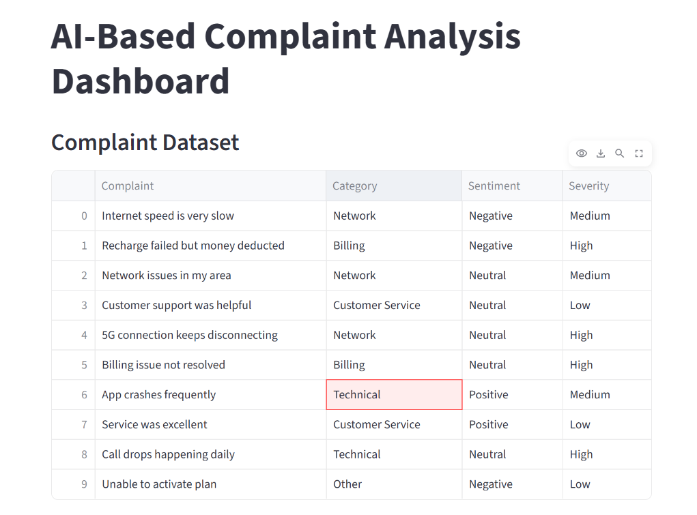
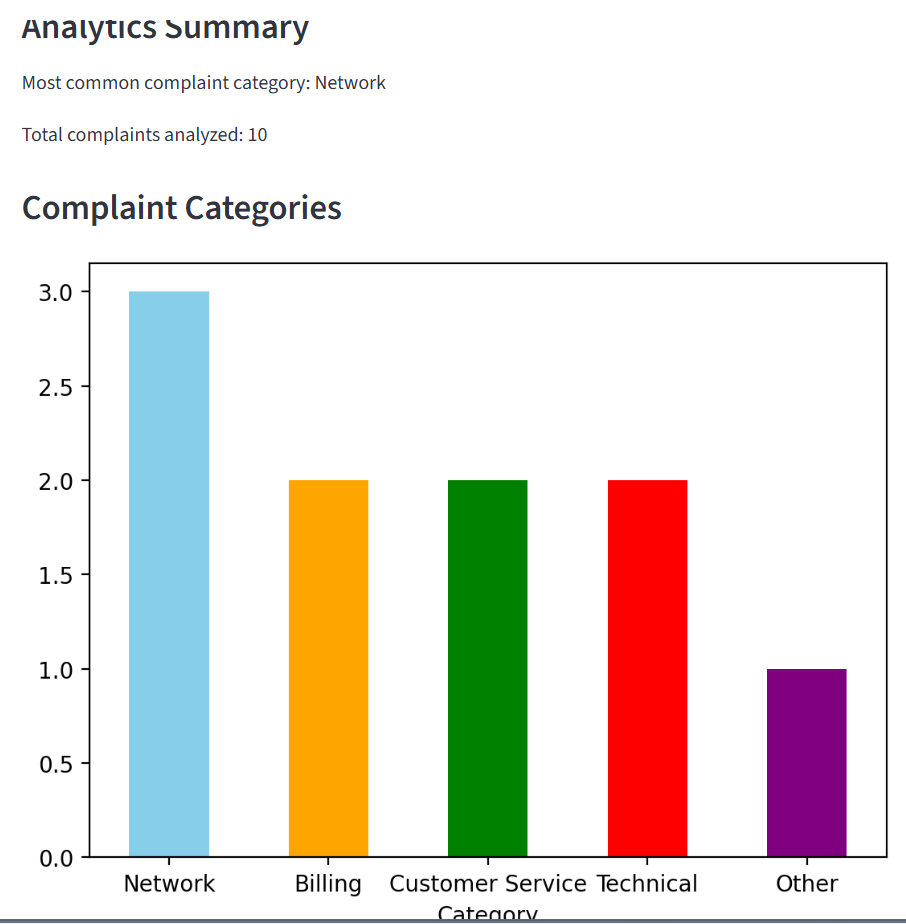
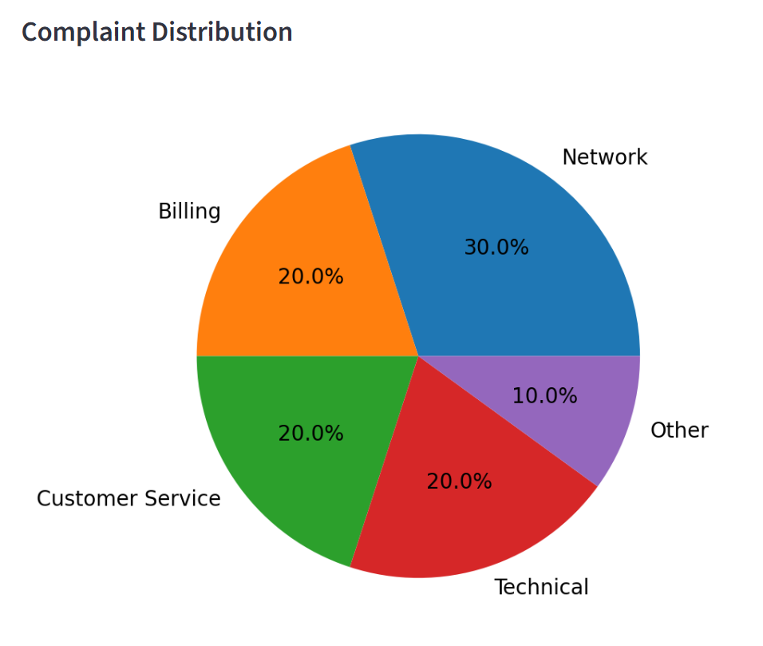

# 🤖 AI-Powered Complaint Analysis Dashboard

> Transforming raw customer complaints into actionable business intelligence using Artificial Intelligence, Natural Language Processing, and Interactive Analytics.


---

## 📌 Overview

Customer complaints contain valuable insights that can help organizations improve customer satisfaction, service quality, and operational efficiency.

The **AI-Powered Complaint Analysis Dashboard** automates complaint analysis by categorizing customer complaints, detecting sentiment, identifying severity levels, and generating interactive visual analytics.

Instead of manually reviewing hundreds or thousands of complaints, organizations can instantly gain meaningful insights through an AI-driven workflow.

---

## 🎯 Problem Statement

Organizations receive large volumes of customer complaints every day.

Challenges include:

- Time-consuming manual analysis
- Delayed issue identification
- Difficulty prioritizing critical complaints
- Lack of actionable insights
- Inefficient decision-making

This project addresses these challenges by converting unstructured customer feedback into structured business intelligence.

---

## ✨ Features

### 🏷 Complaint Categorization

Automatically classifies complaints into categories such as:

- Network Issues
- Billing Issues
- Technical Problems
- Customer Service
- Other

---

### 😊 Sentiment Analysis

Detects customer sentiment:

- Positive
- Neutral
- Negative

Helping businesses understand customer satisfaction levels.

---

### 🚨 Severity Detection

Identifies complaint urgency:

| Severity | Description |
|-----------|------------|
| High | Immediate attention required |
| Medium | Important but not critical |
| Low | Minor concern or feedback |

---

### 📊 Interactive Analytics Dashboard

Provides:

- Complaint distribution analysis
- Sentiment insights
- Category breakdown
- Severity statistics
- Business intelligence metrics

---

### 📁 Report Generation

Exports processed data into:

```text
analyzed_complaints.csv
```

for reporting and decision-making purposes.

---

## 🧠 AI Workflow

```text
Customer Complaint
        │
        ▼
Text Processing
        │
        ▼
Complaint Categorization
        │
        ▼
Sentiment Analysis
        │
        ▼
Severity Detection
        │
        ▼
Analytics Generation
        │
        ▼
Interactive Dashboard
```

---

## 🛠 Technology Stack

| Technology | Purpose |
|------------|----------|
| Python | Core Programming |
| Pandas | Data Processing |
| TextBlob | Sentiment Analysis |
| Matplotlib | Data Visualization |
| Streamlit | Dashboard Development |
| CSV Dataset | Data Storage |

---

## 📂 Project Structure

```text
AI-Complaint-Analysis/
│
├── app.py
├── complaint_analysis.py
├── complaints.csv
├── analyzed_complaints.csv
├── complaint_chart.png
├── requirements.txt
├── LICENSE
└── README.md
```

---

## 📈 Business Value

This system helps organizations:

✅ Identify recurring customer issues

✅ Improve customer satisfaction

✅ Prioritize critical complaints

✅ Reduce manual effort

✅ Generate actionable insights

✅ Support data-driven decisions

---

## 📊 Sample Insights

```text
Total Complaints Analyzed : 500

Most Common Category      : Network

Negative Sentiment        : 62%

High Severity Issues      : 18%

Recommended Action:
Improve network infrastructure
and prioritize outage complaints.
```

---

## 🚀 Installation

### Clone Repository

```bash
git clone https://github.com/Nikhileswar-I/ComplaintAnalysisProject.git
```

### Navigate to Project

```bash
cd ComplaintAnalysisProject
```

### Install Dependencies

```bash
pip install -r requirements.txt
```

### Run Dashboard

```bash
streamlit run app.py
```

---

## 📸 Dashboard Preview

### Main Dashboard



### Complaint Analytics



### Sentiment Analysis


---

## 🔮 Future Enhancements

### Machine Learning

- Logistic Regression Classification
- Naive Bayes Classification
- Random Forest Classification

### Advanced AI Features

- LLM Integration (Gemini/OpenAI)
- Automatic Complaint Summarization
- AI-Generated Recommendations
- Real-Time Complaint Analysis

### Dashboard Improvements

- Interactive Plotly Charts
- Advanced Filtering
- Search Functionality
- Downloadable Reports

### Deployment

- Streamlit Cloud Deployment
- Docker Support
- REST API Integration

---

## 🎓 Learning Outcomes

This project demonstrates:

- Natural Language Processing (NLP)
- Sentiment Analysis
- Data Analytics
- Dashboard Development
- Python Programming
- Business Intelligence
- Data Visualization

---

## 👨‍💻 Author

### Nikhileswar Inala

Computer Science & Engineering (AI & ML)

Passionate about:

- Artificial Intelligence
- Machine Learning
- Data Analytics
- Data Science
- Software Development

GitHub:
https://github.com/Nikhileswar-I

LinkedIn:
https://www.linkedin.com/in/nikhileswar-inala

---

## ⭐ Why This Project Matters

Customer complaints are often overlooked sources of business intelligence.

This project demonstrates how Artificial Intelligence and Data Analytics can transform raw customer feedback into meaningful insights that support better decision-making and improved customer experiences.

The system showcases the practical application of AI in solving real-world business problems.

---

## 📜 License

This project is licensed under the MIT License.

See the LICENSE file for complete details.

---

## © Copyright

Copyright © 2026 Nikhileswar Inala

Permission is granted under the MIT License to use, modify, and distribute this software.

Developed for educational, research, and portfolio purposes.

---

### 🚀 Built with Python, Streamlit, NLP, and AI-Powered Analytics
